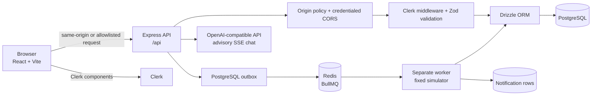

# DeployX Lite

DeployX Lite is a small deployment-control-plane demonstration for managing
projects, environment variables, simulated deployment runs, deployment
history, notifications, and an advisory AI chat. Deployment records are
durably queued through BullMQ and processed by a separate worker, but the
worker still advances a fixed simulation: it does not clone a repository,
execute an untrusted build, or deploy an artifact.

This README is the source-of-truth documentation for the code currently in
this repository. Status labels are deliberate:

- **Implemented** — present in the source and wired into the application.
- **Partially implemented** — a usable slice exists, but an important
  production concern or part of the promised behavior is missing.
- **Simulated** — the UI and persisted state model the behavior without doing
  the real external operation.
- **Scaffolded** — configuration or a surface exists, but it is not a complete
  production capability.
- **Planned** — design direction only; it must not be read as an existing
  dependency or service.
- **Not implemented** — no corresponding implementation is present.

## Product overview

The browser application lets an authenticated user:

1. Sign in or sign up through Clerk.
2. Create, edit, duplicate, archive, and delete project records.
3. Store environment-variable values encrypted at rest and see masked values.
4. Start a queued simulated pipeline and watch its persisted progress, logs,
   and notifications.
5. View deployment history and start a simulated rollback.
6. Ask an external OpenAI-compatible model for deployment advice through a
   server-side, streaming chat route.

The application does **not** provide real deployment execution, repository
cloning, build isolation, artifact storage, or team RBAC. The queue and worker
are implemented, but they process the fixed simulation rather than arbitrary
repository code.

## Current source-verified status

| Capability | Status | What the current source actually does |
| --- | --- | --- |
| React user interface | **Implemented** | `artifacts/deployx-lite` is a React application. |
| Vite development/build tooling | **Implemented** | The frontend uses `vite.config.ts` and Vite scripts. |
| Express API | **Implemented** | `artifacts/api-server` creates an Express 5 application and mounts `/api`. |
| Origin checks | **Implemented** | Same-origin requests are allowed; cross-origin credentialed requests require `CORS_ALLOWED_ORIGINS` or `ALLOWED_ORIGINS`. |
| Clerk authentication and owner isolation | **Implemented** | Clerk React components and Clerk Express middleware gate workspace routes; resource queries are scoped to the authenticated owner. |
| Project CRUD | **Implemented (owner scoped)** | CRUD handlers and Drizzle records exist; new records carry an owner ID and legacy rows with a null owner are not claimable. |
| Environment variables | **Partially implemented** | AES-256-GCM encryption, versioning, masking, and CRUD exist; key rotation and a managed key service do not. |
| Deployment pipeline | **Simulated through a durable queue** | The API writes a PostgreSQL outbox row; BullMQ publishes it to Redis and a separate worker writes fixed simulated stages. |
| Deployment history and logs | **Simulated** | Records, progress, logs, failure messages, and rollback records are stored, but no real artifact is produced. |
| Notifications | **Implemented (owner scoped)** | In-app notification rows are created by the simulator and read/updated only for the authenticated owner. |
| AI assistant | **Partially implemented / advisory** | Server-side OpenAI-compatible SSE chat and owner-scoped conversation persistence exist, with input/context bounds, a per-process rate limit, and generic provider errors. It does not execute deployment actions. |
| Drizzle ORM | **Implemented** | PostgreSQL tables are defined under `lib/db/src/schema`. |
| PostgreSQL | **Implemented as the database target** | The database package uses `drizzle-orm/node-postgres`; Docker Compose supplies PostgreSQL. |
| Docker configuration | **Implemented and smoke-tested** | Multi-stage API, web, worker, and migration targets plus PostgreSQL/Redis Compose services are checked in; the local Compose stack returned healthy web and API endpoints. |
| API integration tests | **Implemented; locally verified** | Vitest/Supertest covers owner isolation, origin policy, idempotency, and queue processing; the current API suite passes 30/30 tests against PostgreSQL and an isolated Redis database. |
| RBAC | **Not implemented** | There is no server-side role/permission policy. A user being signed in is not RBAC. |
| Custom JWT/refresh-token system | **Not implemented** | Authentication is delegated to Clerk; this repository does not issue or rotate its own JWTs. |
| Redis | **Implemented as a queue dependency** | Docker Compose and CI provide Redis with a health check; production must provide durable, monitored Redis. |
| BullMQ | **Implemented for simulated deployment jobs** | Deployment jobs use an idempotent PostgreSQL outbox and BullMQ job IDs. |
| Separate worker | **Implemented for the fixed simulation** | `artifacts/api-server/dist/worker.mjs` runs independently from the API. It is not an isolated build runner. |
| Isolated worker/build runner | **Planned** | The current worker never executes repository-provided commands. |
| Real repository deployment | **Not implemented** | The repository endpoint returns metadata-shaped data; it does not clone, install, test, build, or deploy a repository. |
| CI/CD workflow | **Implemented; verification pending** | `.github/workflows/ci.yml` runs lint, typecheck, schema setup, tests, build, and API/web/worker Docker builds. Its hosted run is evidence still to be collected. |
| Playwright end-to-end tests | **Implemented configuration; verification pending** | `e2e/` covers an authenticated persisted lifecycle; the manual workflow requires protected Clerk test secrets. |

### Names that are not the current stack

The current implementation is **React + Vite + Express + Drizzle +
PostgreSQL + Clerk**, with a BullMQ/Redis-backed fixed deployment simulator
and an OpenAI-compatible server integration. The following are **not
implemented technologies in this repository**: Next.js, NestJS, Prisma, and a
custom JWT/RBAC implementation. `Next.js` appears only as a value in seeded
demo data and UI copy; that does not make it an application dependency.
Likewise, a package build configuration may list optional external modules,
but an external-module allowlist is not an implementation.

## Architecture

The verified current architecture is documented in
[docs/architecture.md](docs/architecture.md). In brief:

The current worker does not clone repositories or execute arbitrary code. There
is no isolated runner, artifact registry, or deployment environment in this
diagram. The planned worker isolation design is intentionally separate and is
not a description of the running system.

## Repository map

| Path | Responsibility |
| --- | --- |
| `artifacts/deployx-lite/src` | React/Vite UI, Clerk UI, routing, query hooks, and screens |
| `artifacts/api-server/src` | Express app, Clerk middleware, API routes, queue, simulator worker, and logging |
| `lib/db/src` | Drizzle PostgreSQL connection and table schemas |
| `lib/api-spec/openapi.yaml` | OpenAPI contract served through Swagger UI at `/docs` |
| `lib/api-zod` | Runtime request/response validation generated from the API contract |
| `lib/api-client-react` | Generated React API hooks and fetch client |
| `lib/integrations-openai-ai-server` | Server-side OpenAI-compatible client |
| `Dockerfile`, `docker-compose.yml` | Container and local PostgreSQL/Redis/API/web/worker configuration |
| `artifacts/api-server/src/queue` | BullMQ queue, PostgreSQL outbox reconciliation, and fixed simulation worker |
| `.github/workflows/ci.yml` | CI quality checks and API/web/worker image builds |
| `docs/local-setup.md` | Authoritative local setup commands (maintained separately) |
| `docs/architecture.md` | Current and planned architecture |
| `docs/technical-report.md` | Source audit and engineering limitations |
| `docs/demo-guide.md` | Reproducible manual demonstration script |

## Setup and commands

Use [docs/local-setup.md](docs/local-setup.md) for the authoritative
environment, database, dependency-installation, and run commands. This
README intentionally does not duplicate those commands so the setup guide
cannot drift from the workspace configuration.

At a minimum, local use requires:

- Node.js and pnpm compatible with the workspace lockfile.
- A PostgreSQL connection in `DATABASE_URL`.
- A Redis connection in `REDIS_URL` and an always-on worker process for
  deployment status transitions.
- Clerk publishable and secret keys for sign-in and API session validation.
- A long random `SESSION_SECRET` for the current environment-variable
  encryption key derivation.
- AI integration credentials only when demonstrating the assistant. The
  current server integration reads
  `AI_INTEGRATIONS_OPENAI_API_KEY` and
  `AI_INTEGRATIONS_OPENAI_BASE_URL`; these names are also documented in the
  checked-in `.env.example`.

The API serves its OpenAPI/Swagger surface at `/docs` and a basic health
response at `/api/healthz` when the API server is running. Authenticated
workspace routes are listed in `lib/api-spec/openapi.yaml`.
1. Clone & Install
cd deployx-lite
cp .env.example .env
npm install
2. Start Infrastructure
With Docker:

docker compose up postgres redis -d
Without Docker: Run PostgreSQL and Redis locally and update .env.

3. Database Setup
# Set DATABASE_URL in apps/api/.env or root .env
npm run db:generate
npm run db:migrate
npm run db:seed
4. Run Development Servers
# Terminal 1 — API (port 3001)
npm run dev:api

# Terminal 2 — Web (port 3000)
npm run dev:web
5. Open the App
URL	Description
http://localhost:5173/	Web dashboard

## Security and data handling

### Authentication and ownership status

Clerk supplies the browser sign-in UI and server session identity. The API uses
a `requireAuth` middleware that rejects requests without a Clerk `userId`.
Resource ownership is now implemented in source: new projects,
conversations, and notifications store the authenticated owner ID; project
and child-resource access is scoped through that owner; and legacy rows with
null ownership are inaccessible rather than claimable.

The source includes ownership-isolation and unauthenticated/origin regression
tests. The final main-agent test run is still a verification placeholder, so
do not report test results until that run completes. Ownership is not RBAC:
there is still no server-side role/permission matrix.

### Environment-variable encryption

The current code derives one process-wide AES-256-GCM key by hashing
`SESSION_SECRET` with SHA-256. Each value gets a fresh 12-byte random IV.
The stored payload is `iv:authenticationTag:ciphertext`, all encoded as hex.
The authentication tag is verified during decryption. API responses return a
masked value, never the plaintext value.

This is useful application-level protection, but it is not a complete
production secrets-management design:

- The key is derived at startup and is not versioned in the ciphertext.
- There is no dual-read/re-encrypt key rotation procedure.
- Changing `SESSION_SECRET` makes existing ciphertext undecryptable.
- Anyone who obtains the process secret and database can decrypt values.
- The API now refuses to start when `SESSION_SECRET` is missing; there is no
  safe default.
- Key storage, rotation, access auditing, and recovery should move to a
  dedicated KMS/Vault/Key Vault integration before production use.

### Secrets and logs

Do not commit `.env`, API keys, database credentials, Clerk secret keys, or
encryption secrets. The Pino logger redacts authorization/cookie headers, but
callers must still avoid putting secret values in request bodies, model prompts,
logs, or error messages.

## AI assistant scope

The assistant sends a system prompt, bounded persisted conversation history,
and the new user message to the server-side OpenAI-compatible client. The
browser does not receive the provider API key. Responses stream as SSE and
are persisted after the stream completes. The API limits conversation titles
to 200 characters, messages to 12,000 characters, context to 40 messages and
60,000 characters, completion output to 2,048 tokens, and messages to 20 per
authenticated user per minute in each API process. Provider failures return a
generic temporary-unavailability message rather than the provider's raw error.

It is **advisory only**: it cannot start, approve, cancel, roll back, or
otherwise control a deployment. Treat repository text, logs, and model output
as untrusted. Remaining limitations include no explicit prompt-injection
filtering, no distributed rate limiter across API replicas, no cost
monitoring/budget enforcement, no provider retry/timeout policy, and no
structured model-output validation. AI output should not be represented as
successful deployment evidence.

## Reproducible demonstration

Follow the setup commands in [docs/local-setup.md](docs/local-setup.md), then
use the step-by-step run sheet in [docs/demo-guide.md](docs/demo-guide.md).
The guide is a reproducible script for a live local run; it is **not** a claim
that a demo video exists. It also identifies seeded sample records and
simulated repository metadata so they cannot be mistaken for real deployment
history, repository evidence, or authorship.

## Known limitations and roadmap

The next engineering steps are, in order:

1. Run the source-level ownership, origin, and AI-limit tests through the main
   hosted CI workflow and keep the result attached to the submission.
2. Validate the hosted CI workflow and authenticated browser E2E workflow.
3. Replace the fixed simulation with an isolated worker/build runner.
4. Add resource limits, artifact provenance, and real deployment adapters.
5. Add server-side RBAC, AI abuse/cost controls, and browser E2E coverage.

These are roadmap items, not current capabilities.

## Production deployment requirement

The queue is durable only when PostgreSQL, Redis, and the worker are all
running. The API writes deployment intent to PostgreSQL and does not run jobs
itself; the worker reconciles the outbox and processes BullMQ jobs. An
autoscaled API service deployed without an always-on worker and Redis will
accept queued records that never advance. Production must deploy and monitor a
separate worker service, provide persistent/managed Redis with an appropriate
availability and backup policy, and alert on stale outbox rows and stalled
jobs. The Replit autoscale API deployment alone is therefore insufficient for
the current queue architecture.

## Source-audit documents

- [Architecture](docs/architecture.md)
- [Technical report](docs/technical-report.md)
- [Demo guide](docs/demo-guide.md)
- [P0 fixes walkthrough](docs/p0-fixes.md)
- [P1 implementation summary](docs/p1-fixes.md)
