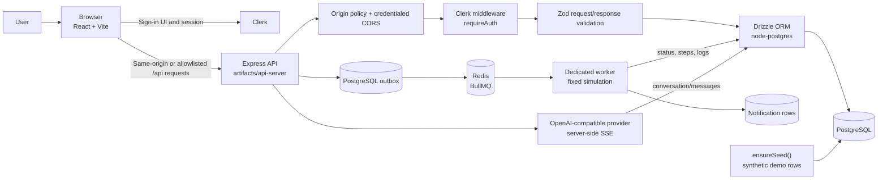
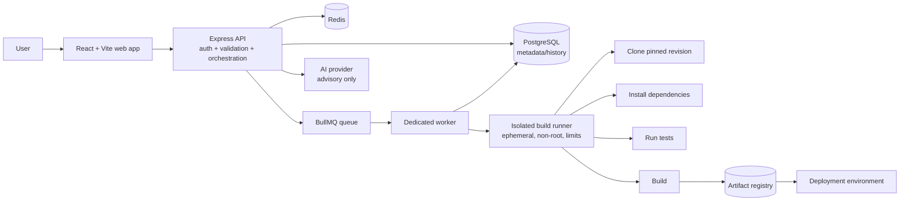

# DeployX Lite architecture

This document describes the architecture that is actually present in the
repository. The fixed simulation now uses a durable PostgreSQL outbox plus
Redis/BullMQ worker. A future isolated build runner is included later, but is
explicitly marked **Planned** and must not be read as a description of the
running application.

## Current architecture — Implemented queue, simulated work



### Components verified in source

| Component | Status | Source/effect |
| --- | --- | --- |
| React UI | **Implemented** | `artifacts/deployx-lite/src` |
| Vite dev/build server | **Implemented** | `artifacts/deployx-lite/vite.config.ts` |
| Express API | **Implemented** | `artifacts/api-server/src/app.ts` |
| Clerk browser/server integration | **Implemented (authentication and owner scoping)** | `App.tsx`, `app.ts`, and route owner predicates |
| Credentialed origin checks | **Implemented** | Same-origin or explicitly configured origins are accepted; other origins receive `403`. |
| Drizzle PostgreSQL adapter | **Implemented** | `lib/db/src/index.ts` |
| Request validation | **Implemented** | `@workspace/api-zod` schemas in route handlers |
| Pino HTTP logging | **Implemented** | `app.ts` and `lib/logger.ts`; request auth/cookie fields are redacted |
| PostgreSQL outbox | **Implemented** | Deployment creation and its outbox event commit in one transaction. |
| Redis/BullMQ queue | **Implemented** | The worker publishes unpublished outbox rows with the deployment UUID as an idempotent job ID. |
| Deployment engine | **Simulated** | The separate worker updates rows after fixed delays; it never runs repository code. |
| AI chat | **Partially implemented / advisory** | `routes/openai.ts` persists owner-scoped messages, bounds input/context, limits per-process requests, and streams provider output |
| Separate worker | **Implemented for simulation** | `dist/worker.mjs` consumes jobs independently from the API. |
| Isolated build sandbox | **Planned** | No repository commands, artifact registry, or deployment adapter exists. |

### Request lifecycle

1. The browser renders the React/Vite app. Clerk renders sign-in/sign-up and
   maintains the browser session.
2. Vite proxies `/api` and `/docs` to the API during local development.
3. Express adds Pino HTTP logging, the Clerk proxy (production only), origin
   checks plus CORS, body parsing, and Clerk middleware.
4. The API router mounts health, project/deployment, notification, and
   `/openai` routes.
5. Workspace route groups call a small `requireAuth` middleware that checks
   `getAuth(req).userId`, then parse inputs with generated Zod schemas.
6. Route handlers read/write PostgreSQL through Drizzle.
7. `POST /api/projects/:projectId/deployments` inserts a `queued` row and a
   matching outbox row in one PostgreSQL transaction.
8. The worker reconciliation loop publishes unpublished outbox rows to Redis
   through BullMQ. The deployment UUID is the BullMQ job ID, so reconciliation
   retries do not create duplicate jobs.
9. The worker advances the fixed six-step simulation, persists progress/logs,
   and commits the terminal notification with the deployment update. BullMQ
   retries transient worker failures with bounded exponential backoff.
10. The UI polls active deployments once per second and renders persisted
    steps/logs.

The deployment response is asynchronous from the HTTP caller's perspective
(the endpoint returns `202`). PostgreSQL is the durable intent/outbox store and
Redis/BullMQ is the delivery mechanism. Redis and the worker remain required:
an API-only deployment can persist queued records but cannot advance them.

## Data model

Drizzle defines these PostgreSQL tables:

- `deployx_projects`: owner ID, project metadata, repository URL, branch,
  framework, environment, tags, and status. The owner ID is nullable only for
  legacy rows, which owner predicates exclude.
- `deployx_environment_variables`: project reference, key, encrypted value,
  environment, version, and update time.
- `deployx_deployments`: project reference, number, status, progress, steps,
  logs, duration, trigger label, attempt counters, completion time, failure
  reason, and terminal-notification idempotency flag.
- `deployx_deployment_outbox`: deployment/project/owner queue payload, rollback
  flag, publish timestamp, publish-attempt count, and the last Redis error.
- `deployx_notifications`: in-app notification text and optional project and
  deployment identifiers.
- `conversations` and `messages`: persisted AI conversation history, with a
  foreign key from messages to conversations.

The current security change adds nullable `owner_id` columns to project,
conversation, and notification records and scopes resource access by the
authenticated owner. Environment variables and deployments inherit project
scope rather than carrying their own owner column. Legacy rows with null owner
IDs are not returned to authenticated users and cannot be claimed. Source
regression tests cover cross-owner project/deployment/notification/AI access;
the API suite passed locally with PostgreSQL and an isolated Redis database.
**This is owner isolation, not RBAC.**

## Authentication and authorization

Clerk is the authentication provider. The browser uses `@clerk/react`; the
API uses `@clerk/express`. Workspace routes reject requests without a Clerk
`userId`. No password hashing, custom JWT issuance, refresh-token store, or
server-side role matrix is implemented here.

Current authorization status:

- **Authentication: Implemented.**
- **RBAC: Not implemented.**
- **Resource ownership: Implemented and covered by the locally passing API test suite.**
- **Organization/team authorization: Not implemented in route policy.**

The UI can display a Clerk organization name, but display is not permission
enforcement.

## Environment-variable protection

The API derives an AES-256-GCM key as:

```text
key = SHA-256(SESSION_SECRET)
payload = hex(random 12-byte IV):hex(GCM authentication tag):hex(ciphertext)
```

Each encryption call generates a new 12-byte IV with `randomBytes`. Decryption
sets the stored tag before finalizing, so tampering causes authentication
failure. Responses use a masked representation rather than plaintext.

This design has important limitations:

1. There is one unversioned process key.
2. There is no key identifier or dual-key migration path.
3. Rotating `SESSION_SECRET` without a migration makes all old values
   undecryptable.
4. Existing values are not automatically re-encrypted.
5. The API now refuses to start when `SESSION_SECRET` is absent; there is no
   safe default.
6. Key compromise exposes every value encrypted with that key.

Production evolution should store key-encryption keys in AWS KMS, Azure Key
Vault, HashiCorp Vault, or an equivalent dedicated service. A rotation design
would retain the old key for decrypt-only migration, write a key version with
each ciphertext, re-encrypt records in a controlled job, then retire the old
key after verification and backup policy review.

## AI architecture and limits

`POST /api/openai/conversations/:id/messages`:

1. authenticates with Clerk;
2. validates the message body;
3. stores the user message;
4. loads the conversation history;
5. prepends the server-owned system prompt;
6. calls the server-side OpenAI-compatible client with streaming enabled;
7. writes SSE chunks to the browser; and
8. stores the completed assistant message.

The provider key is not intentionally sent to the browser. The assistant is
advisory and has no tool or route that executes deployment operations. Logs,
repository text, and model output must be treated as untrusted input. Current
code enforces title/message/context bounds, a 2,048-token completion ceiling,
and a 20-per-minute in-process per-user message limit. Provider failures are
returned as a generic temporary-unavailability message. Remaining hardening
work includes prompt-injection defenses, a distributed limiter for multiple
API replicas, cost monitoring, provider retry/timeout policy, and structured
output validation.

## Planned future architecture — Planned, not running

The safe production direction is to keep the API out of untrusted build
execution:



The isolated runner, artifact registry, and deployment target in this diagram
are **Planned**. Redis, BullMQ, and the fixed simulation worker are implemented
in the current stack; they are not an isolated build system.

The planned worker boundary is needed because a repository can contain
malicious scripts and resource exhaustion. A production design should:

- enqueue an idempotency key and reject duplicate active jobs;
- persist state transitions and retry metadata in PostgreSQL;
- use bounded retries with explicit terminal failure;
- isolate each build in an ephemeral sandbox with a non-root user,
  filesystem/network policy, CPU/memory/time limits, and secret scoping;
- pin the requested commit and record artifact provenance;
- never give the worker API signing keys or unrelated tenant secrets;
- publish logs/status back through the queue/database rather than executing
  arbitrary code in the API process; and
- require an explicit deployment adapter/policy before promoting an artifact.

This is a design target, not a current feature.

## Operational and documentation boundaries

`/api/healthz` returns a basic `{ "status": "ok" }` liveness response. It is
not a dependency-aware readiness check: it does not verify PostgreSQL, Redis,
or worker freshness. Operations must separately monitor the worker process,
Redis health, stale outbox rows, and stalled BullMQ jobs.

An API-only autoscale deployment is insufficient: it can write durable queued
records but cannot process them. Production requires an always-on worker and a
persistent/managed Redis service alongside the API and PostgreSQL.

Use [docs/local-setup.md](local-setup.md) for local commands. The source
security fixes are documented in [p0-fixes.md](p0-fixes.md). Hosted CI and
authenticated browser E2E results should be reviewed before production use.