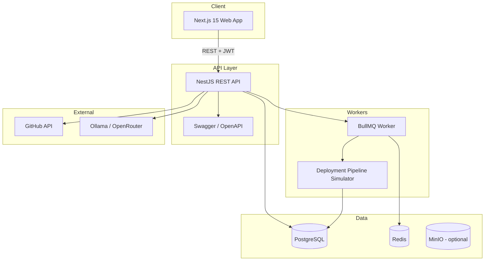

# DeployX Lite — Architecture

## System Overview

DeployX Lite is a monorepo SaaS platform for simulated application deployments and environment management.



## Module Structure (Backend)

| Module | Responsibility |
|--------|----------------|
| Auth | JWT login, register, password reset |
| Projects | CRUD, archive, restore, duplicate |
| EnvVars | Encrypted env var management + history |
| Git | GitHub repo validation via Octokit |
| Deployments | Async pipeline via BullMQ |
| Notifications | In-app notification center |
| AI | LLM-powered deployment assistant |
| Dashboard | Stats and chart data |

## Deployment Pipeline (Simulated)

```
Clone → Install → Test → Build → Deploy → Health Check
```

Each step runs asynchronously with log streaming to PostgreSQL.

## Security

- JWT authentication with role-based access (Admin / Developer)
- Environment variables encrypted at rest (AES-256-GCM)
- Input validation via class-validator + Zod (frontend)
- Helmet middleware, CORS configuration

## Folder Structure

```
deployx-lite/
├── apps/
│   ├── api/          # NestJS backend
│   └── web/          # Next.js frontend
├── docker/           # Dockerfiles
├── docs/             # Architecture & ER diagrams
└── docker-compose.yml
```
