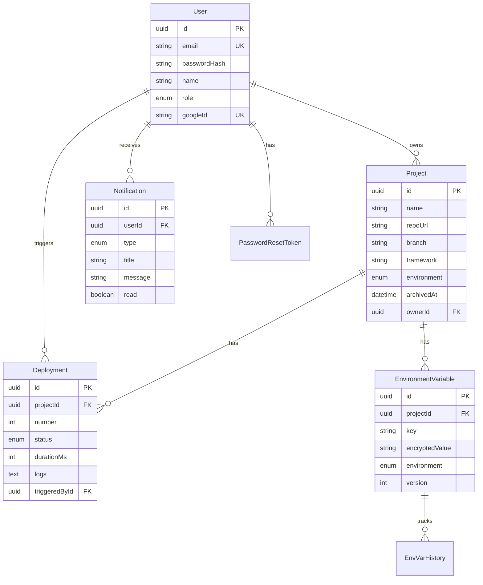

# DeployX Lite — Entity Relationship Diagram

```mermaid
erDiagram
    User ||--o{ Project : owns
    User ||--o{ Deployment : triggers
    User ||--o{ Notification : receives
    User ||--o{ PasswordResetToken : has

    Project ||--o{ EnvironmentVariable : has
    Project ||--o{ Deployment : has

    EnvironmentVariable ||--o{ EnvVarHistory : tracks

    User {
        uuid id PK
        string email UK
        string passwordHash
        string name
        enum role
        string googleId UK
    }

    Project {
        uuid id PK
        string name
        string repoUrl
        string branch
        string framework
        enum environment
        datetime archivedAt
        uuid ownerId FK
    }

    EnvironmentVariable {
        uuid id PK
        uuid projectId FK
        string key
        string encryptedValue
        enum environment
        int version
    }

    Deployment {
        uuid id PK
        uuid projectId FK
        int number
        enum status
        int durationMs
        text logs
        uuid triggeredById FK
    }

    Notification {
        uuid id PK
        uuid userId FK
        enum type
        string title
        string message
        boolean read
    }
```
