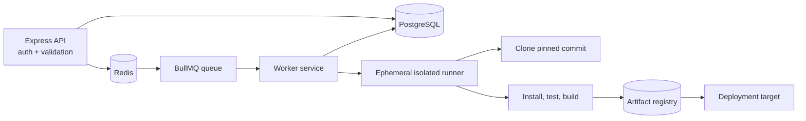

# DeployX Lite technical report

## Purpose and source basis

This report corrects the repository/documentation mismatch identified in the
initial assessment. It describes the source currently checked into this
workspace, not a proposed architecture and not an aspirational feature list.
The assessment's recommendation to use explicit implementation statuses is
followed throughout this report.

The relevant source is under `artifacts/api-server`, `artifacts/deployx-lite`,
`lib/db`, `lib/api-spec`, and
`lib/integrations-openai-ai-server`. The assessment's React/Vite/Express/
Drizzle/PostgreSQL/Clerk description matches the implementation. The
alternative Next.js/NestJS/Prisma/JWT/RBAC description does not match the
current dependency files or request paths; Redis/BullMQ are now present only
for the fixed simulated worker, not as a real deployment executor.

## Executive summary

DeployX Lite is a React/Vite frontend and Express API backed by PostgreSQL
through Drizzle. Clerk provides authentication. Project, environment,
deployment-record, notification, and AI-conversation routes are present.
Deployments use a PostgreSQL outbox and Redis/BullMQ worker, but the work is
still a **fixed simulation**: the API inserts a row and outbox event, and the
separate worker writes illustrative steps and logs. No repository is cloned
and no arbitrary code is executed.

The AI route is a server-side, streaming, OpenAI-compatible chat integration.
It is an advisory assistant and has no deployment tools. It is not evidence
that an AI model performed or verified a deployment.

The main limitations are absent RBAC, simulated rather than real deployment,
no key rotation, remaining AI hardening, and no isolated build runner. Local
typecheck, API tests, workspace build, and Docker image builds have passed.
Hosted CI and authenticated browser E2E results remain to be reviewed.

## Source-verified technology table

| Technology or capability | Status | Evidence and boundary |
| --- | --- | --- |
| React | **Implemented** | `artifacts/deployx-lite/src` |
| Vite | **Implemented** | Frontend Vite config and scripts |
| Express | **Implemented** | `artifacts/api-server/src/app.ts` |
| Drizzle ORM | **Implemented** | `lib/db/src/index.ts` and schemas |
| PostgreSQL | **Implemented as target** | `node-postgres` adapter and PostgreSQL Compose service |
| Clerk | **Implemented for authentication and owner scoping** | React provider, sign-in/sign-up pages, Express middleware, owner predicates |
| Credentialed origin checks | **Implemented** | Same-origin requests or explicitly configured origins are allowed; other origins receive `403`. |
| PostgreSQL outbox | **Implemented** | Deployment and queue intent commit in one transaction. |
| Redis/BullMQ queue | **Implemented** | Outbox reconciliation publishes idempotent BullMQ jobs. |
| Separate simulation worker | **Implemented** | `dist/worker.mjs` updates deployment state outside the API process. |
| Fixed pipeline simulation | **Simulated** | Worker advances six illustrative stages; no repository code runs. |
| OpenAI-compatible chat | **Partially implemented / advisory** | Streaming route and persisted conversations |
| Next.js | **Not implemented** | Not a frontend framework dependency; appears as seeded metadata only |
| NestJS | **Not implemented** | No Nest application or dependency |
| Prisma | **Not implemented** | No Prisma schema/client; an external allowlist entry is not usage |
| Custom JWT | **Not implemented** | Clerk sessions are used instead |
| RBAC | **Not implemented** | No role checks or permission policy |
| Isolated build worker | **Planned** | A future sandbox must contain untrusted repository execution. |

## Feature status matrix

| Feature | Status | Accurate interpretation |
| --- | --- | --- |
| Clerk sign-in/sign-up and session gate | **Implemented (authentication)** | Browser and API use Clerk. |
| Resource ownership isolation | **Implemented and locally verified** | New owner IDs scope projects, child resources, notifications, and AI conversations; null-owner legacy rows are inaccessible. |
| RBAC | **Not implemented** | No server-side role model or authorization matrix. |
| Project management | **Implemented (owner scoped)** | CRUD and validation exist, with owner predicates on project access. |
| Environment variables | **Partially implemented** | Values are encrypted/masked and versioned; rotation and managed secret storage are absent. |
| Deployment pipeline | **Simulated through a durable queue** | Six named worker stages update a database row after delays. |
| Deployment history | **Simulated** | History represents simulator records, not real releases or artifacts. |
| Rollback | **Simulated** | Creates another simulator run labeled as a rollback; it does not restore an artifact. |
| In-app notifications | **Implemented (owner scoped)** | Rows are produced/read/updated only for the authenticated owner. |
| AI assistant | **Partially implemented / advisory** | Provider streaming and owner-scoped conversation persistence exist, with input/context bounds, an in-process rate limit, and generic provider errors; it has no operational action execution. |
| Docker configuration | **Implemented and locally built** | API/web/worker/migration targets and PostgreSQL/Redis Compose services build successfully; the local web and API health endpoints responded successfully. |
| CI/CD | **Implemented configuration; hosted verification pending** | GitHub Actions runs lint, typecheck, schema setup, tests, build, and three image targets. |
| Unit/integration test suite | **Implemented; locally verified** | Vitest/Supertest tests cover health, validation, CRUD shapes, masking, simulator responses, ownership isolation, and origins; the API suite passed 30/30 with PostgreSQL and an isolated Redis database. |
| Browser E2E suite | **Implemented configuration; verification pending** | `e2e/` covers an authenticated persisted lifecycle; hosted execution requires protected Clerk test secrets. |

## Backend request and data flow

Express registers Pino HTTP logging, origin checks/CORS, body parsing, Clerk middleware,
Swagger UI, and `/api` routes. Protected route groups call `getAuth(req)` and
return `401` when no `userId` is available. Zod schemas validate request
bodies and response shapes.

The deployment request flow is intentionally limited:

```text
POST /api/projects/:projectId/deployments
  -> validate project id
  -> read project only when it matches the Clerk owner
  -> allocate next display number
  -> insert queued deployment row
  -> insert matching PostgreSQL outbox row in the same transaction
  -> return 202 with the queued record
```

The worker reconciliation loop publishes unpublished outbox rows to Redis
through BullMQ. The deployment UUID is the BullMQ job ID, so a reconciliation
retry does not create a duplicate job. The worker then waits approximately one
second per fixed step and updates status, progress, steps, logs, and failure
reason. Bounded BullMQ retries handle transient worker failures, while the
terminal update and notification are idempotent. This behavior is useful for
demonstrating UI states, but it is not a reliable build or release system.

The OpenAPI document describes the route contract and is exposed through
Swagger at `/docs`. The health endpoint is a basic liveness-style response,
not a database/queue/worker readiness check.

## Frontend behavior

The React app uses Clerk for auth UI, Wouter for routes, TanStack Query for
server state, and generated API hooks from `lib/api-client-react`. Protected
pages include dashboard, projects, project detail, and settings. The project
detail screen polls deployments while their status is `queued` or `running`,
shows simulated steps/logs, masks environment-variable values, and offers
simulated rollback.

The UI's labels such as “pipeline” and “history” describe the simulator's
experience. They must not be presented as proof that a repository was built,
that a production target was changed, or that a person authored the displayed
sample commit.

## Database and history semantics

Drizzle maps project, environment-variable, deployment, notification,
conversation, and message records to PostgreSQL. Environment-variable
ciphertext is stored as text; deployment steps and logs are JSONB.
Conversations/messages use a foreign key with cascade deletion.

`ensureSeed()` creates a first-run sample project, environment variables, and
deployment. The seed includes names, timestamps, logs, and commit-looking
metadata to make the UI demonstrable. These values are **synthetic demo
data**, not imported Git history, deployment evidence, user activity, or
authorship attribution. `repositoryFor()` similarly derives owner/name from
the URL and returns illustrative branch and commit metadata; it does not call
GitHub or verify the repository.

The security change adds nullable `owner_id` columns to project, conversation,
and notification rows and scopes resource access by the authenticated owner.
Environment variables and deployments inherit project scope through an owned
project rather than carrying a separate owner column. Legacy rows with null
owner IDs are inaccessible because all owner predicates require a non-null
matching owner. Source tests cover cross-owner
project/deployment/notification/AI access; the final main-agent test execution
is still pending. This owner isolation is not RBAC: authentication does not
provide a role or permission matrix.

## Environment-variable encryption review

The implementation uses Node's `crypto`:

1. Read the required `SESSION_SECRET`; the current source refuses to start if
   it is missing.
2. SHA-256 hash it into a 32-byte AES-256 key.
3. Generate a fresh 12-byte random IV for every value.
4. Encrypt with AES-256-GCM.
5. Store `ivHex:tagHex:ciphertextHex`.
6. On read, restore the IV/tag/ciphertext and require GCM finalization.
7. Return only a masked value from the API.

This provides confidentiality and tamper detection for the stored payload while
the process secret remains protected. It does not provide key lifecycle
management. There is no versioned key ID, dual-key decrypt migration,
automatic re-encryption, KMS/Vault integration, or recovery plan. Rotating
`SESSION_SECRET` directly makes old values unreadable. A production design
should use a managed key-encryption key (AWS KMS, Azure Key Vault, HashiCorp
Vault, or equivalent), version ciphertexts, migrate under controlled access,
and retire old keys only after verification.

The response masking is defense-in-depth, not authorization. Secrets must not
be sent to logs, AI prompts, browser bundles, or error responses. Pino redacts
authorization/cookie headers, but callers remain responsible for request
content.

## AI assistant review

The server:

- requires the Clerk session;
- stores the user message;
- loads conversation history;
- prepends a server-side system prompt;
- calls the server-side OpenAI-compatible client with a configured model and
  completion-token limit;
- streams text chunks as SSE; and
- stores the assistant message when streaming completes.

The API key is not deliberately exposed to the browser. The assistant is
advisory: there are no tools for deployment, rollback, environment mutation,
or shell execution. It cannot prove that a deployment succeeded.

The current route enforces a 200-character conversation-title limit,
12,000-character message limit, 40-message/60,000-character context bound,
2,048-token completion ceiling, and a 20-message-per-minute per-user limit in
each API process. Provider failures are returned as a generic temporary
unavailability message. Remaining hardening gaps are explicit
prompt-injection handling, a distributed rate limiter across replicas, cost
monitoring/budget enforcement, provider retry/timeout policy, and structured
output validation. Repository content and deployment logs must be treated as
untrusted prompt input. AI suggestions require human review and must not be
used as evidence of authorship, testing, or release approval.

The source integration reads
`AI_INTEGRATIONS_OPENAI_API_KEY` and
`AI_INTEGRATIONS_OPENAI_BASE_URL`. The checked-in `.env.example` documents the
same names. The report intentionally does not claim that Ollama or OpenRouter
is configured.

## Deployment architecture boundary

The current API process is the orchestrator, while the separate worker runs a
fixed simulation. It must not be described as a production arbitrary-code
execution platform. Real deployment is **Not implemented**.

The queue topology has an operational requirement: PostgreSQL, Redis, and an
always-on worker must be deployed together. An autoscaled API service without
the worker and Redis can persist queued records but cannot advance them.
Production Redis must be persistent/managed and monitored, and operators
should alert on stale PostgreSQL outbox rows and stalled BullMQ jobs.

The planned evolution is:



Redis, BullMQ, and the fixed worker are **Implemented**. The isolated runner,
artifact registry, and deployment target are **Planned**. The future design
must add resource limits, network/secret policy, pinned revision provenance,
and malicious-repository containment. Those requirements are not satisfied by
the current fixed simulation.

## Testing and evidence boundaries

The checked-in API test file uses Vitest and Supertest. It mocks Clerk and
skips database-dependent suites when `DATABASE_URL` is absent. It tests route
shapes, validation, CRUD operations, masking, deployment state shape, health,
owner isolation, and origin behavior; it is not a Playwright E2E test and does
not prove real deployment execution. The local run passed 30/30 tests with
PostgreSQL and an isolated Redis database; a concurrently running development
worker can consume test jobs if both processes share the same Redis database.

The local workspace typecheck and production build passed, and all Compose
image targets built successfully. The web and API health endpoints returned
HTTP 200 in the local Compose smoke run. These checks do not claim a real
repository deployment or an authenticated browser E2E run. The reproducible
procedure is in
[docs/demo-guide.md](demo-guide.md). Setup commands belong in
[docs/local-setup.md](local-setup.md). The beginner-oriented P0 change
walkthrough and pending verification checklist are in
[docs/p0-fixes.md](p0-fixes.md).

## Engineering roadmap

1. Confirm the local verification results in hosted CI and review its logs.
2. Run and record the authenticated browser E2E workflow using protected
   Clerk test credentials.
3. Introduce an isolated build runner and real deployment adapter.
4. Add resource limits and artifact provenance beyond the simulated pipeline.
5. Add server-side RBAC, AI abuse/cost safeguards, and browser E2E.

Each item is **Planned** until its source and tests exist.